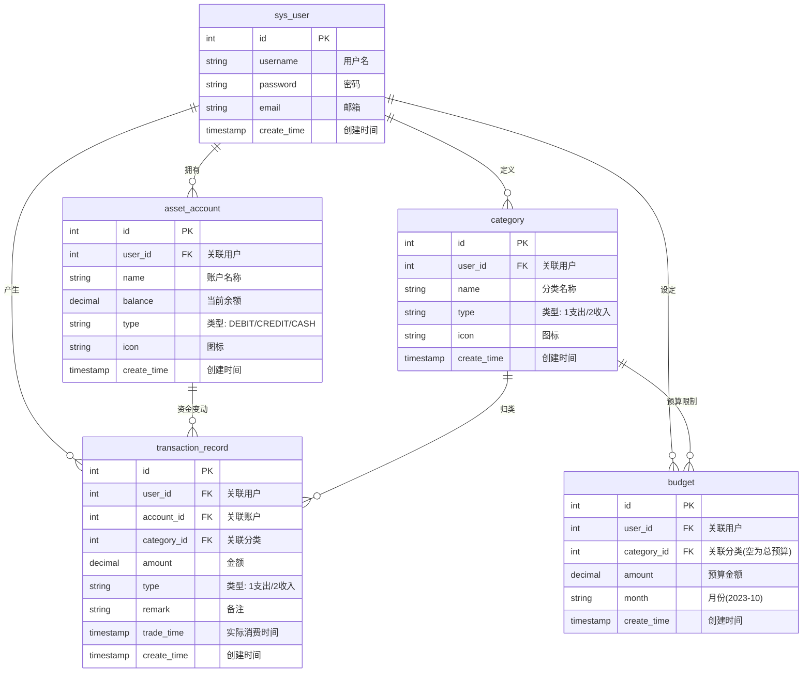

```mermaid
erDiagram
    %% 1. 用户表 (系统使用者)
    sys_user {
        int id PK
        string username "用户名"
        string password "密码"
        string email "邮箱"
        timestamp create_time "创建时间"
    }

    %% 2. 资产账户表 (例如：工商银行卡、微信零钱、支付宝)
    asset_account {
        int id PK
        int user_id FK "关联用户"
        string name "账户名称"
        decimal balance "当前余额"
        string type "类型: DEBIT/CREDIT/CASH"
        string icon "图标"
        timestamp create_time "创建时间"
    }

    %% 3. 收支分类表 (例如：餐饮、交通、工资)
    category {
        int id PK
        int user_id FK "关联用户"
        string name "分类名称"
        string type "类型: 1支出/2收入"
        string icon "图标"
        timestamp create_time "创建时间"
    }

    %% 4. 预算表 (每月限制花多少钱)
    budget {
        int id PK
        int user_id FK "关联用户"
        int category_id FK "关联分类(空为总预算)"
        decimal amount "预算金额"
        string month "月份(2023-10)"
        timestamp create_time "创建时间"
    }

    %% 5. 交易流水表 (核心表)
    transaction_record {
        int id PK
        int user_id FK "关联用户"
        int account_id FK "关联账户"
        int category_id FK "关联分类"
        decimal amount "金额"
        string type "类型: 1支出/2收入"
        string remark "备注"
        timestamp trade_time "实际消费时间"
        timestamp create_time "创建时间"
    }

    %% 关系定义
    sys_user ||--o{ asset_account : "拥有"
    sys_user ||--o{ category : "定义"
    sys_user ||--o{ budget : "设定"
    sys_user ||--o{ transaction_record : "产生"
    
    asset_account ||--o{ transaction_record : "资金变动"
    category ||--o{ transaction_record : "归类"
    category ||--o{ budget : "预算限制"
```