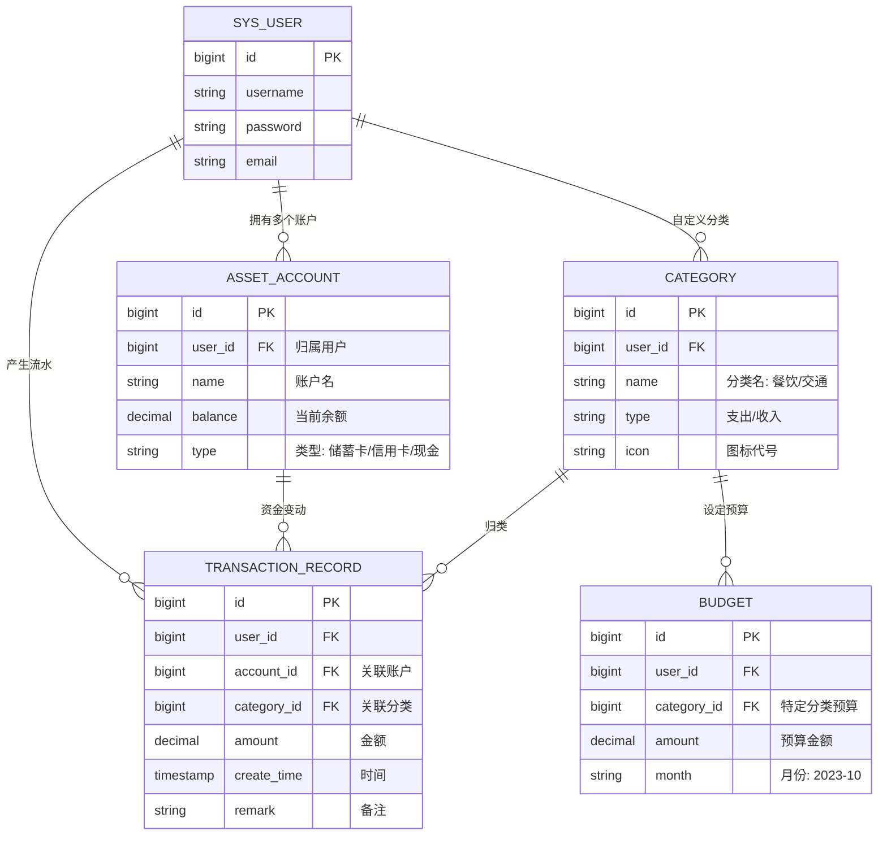

```mermaid
erDiagram
    %% 用户表：系统的核心
    SYS_USER {
        bigint id PK
        string username
        string password
        string email
    }

    %% 资产账户表：存钱的地方（微信、银行卡）
    ASSET_ACCOUNT {
        bigint id PK
        bigint user_id FK "归属用户"
        string name "账户名"
        decimal balance "当前余额"
        string type "类型: 储蓄卡/信用卡/现金"
    }

    %% 分类表：花钱的名目
    CATEGORY {
        bigint id PK
        bigint user_id FK
        string name "分类名: 餐饮/交通"
        string type "支出/收入"
        string icon "图标代号"
    }

    %% 预算表：每月的限额
    BUDGET {
        bigint id PK
        bigint user_id FK
        bigint category_id FK "特定分类预算"
        decimal amount "预算金额"
        string month "月份: 2023-10"
    }

    %% 交易流水表：核心记账本
    TRANSACTION_RECORD {
        bigint id PK
        bigint user_id FK
        bigint account_id FK "关联账户"
        bigint category_id FK "关联分类"
        decimal amount "金额"
        timestamp create_time "时间"
        string remark "备注"
    }

    %% 关系定义
    SYS_USER ||--o{ ASSET_ACCOUNT : "拥有多个账户"
    SYS_USER ||--o{ CATEGORY : "自定义分类"
    SYS_USER ||--o{ TRANSACTION_RECORD : "产生流水"
    ASSET_ACCOUNT ||--o{ TRANSACTION_RECORD : "资金变动"
    CATEGORY ||--o{ TRANSACTION_RECORD : "归类"
    CATEGORY ||--o{ BUDGET : "设定预算"
```