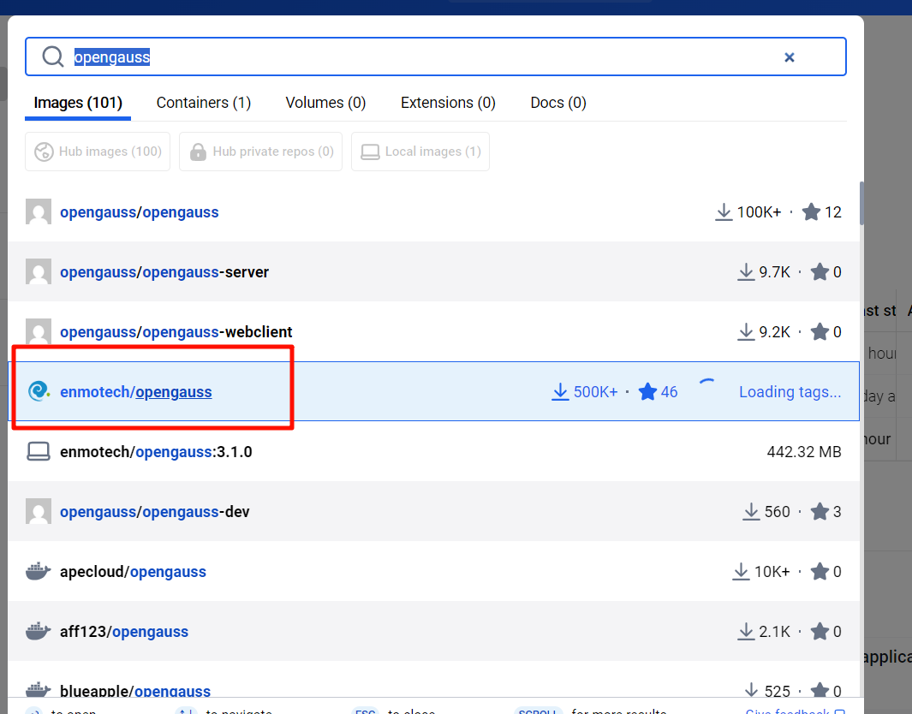
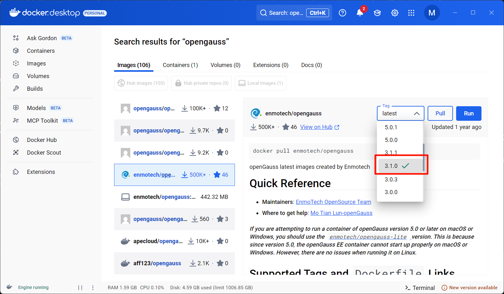
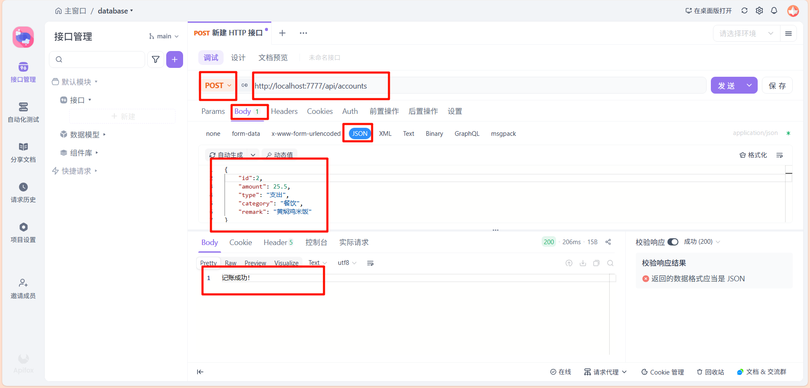
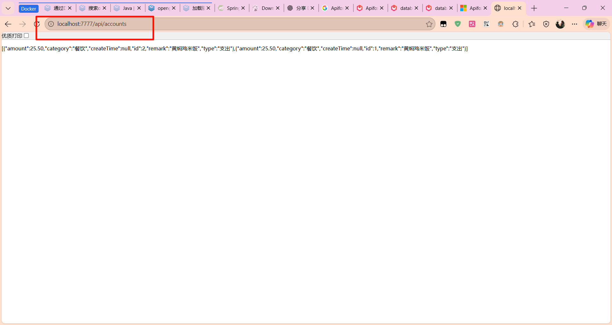

> [!NOTE]
> 切换到最新分支：[buzhang_database@1.0.1](https://github.com/ML-Leslie/buzhang_database/tree/buzhang%401.0.0?tab=readme-ov-file)

> - 在 windows 上使用该教程
### 如何运行 opengauss 并使用 java 连接它
#### docker 运行 opengauss 
- 在docker desktop 中搜索：
  - 
  - 选择版本：
  - 下载下来后，打开终端，运行以下命令：
    - `docker run --name opengauss --privileged=true -d -e GS_PASSWORD=OpenGauss@123 -p 5432:5432 enmotech/opengauss:3.1.0`
    - 命令解释：
      - `docker run`：运行一个容器
      - `--name opengauss`：为容器指定名称
      - `--privileged=true`：授予容器特权模式
      - `-d`：以后台模式运行容器
      - `-e GS_PASSWORD=OpenGauss@123`：设置环境变量，其中 `GS_PASSWORD` 是 GaussDB 的密码
      - `-p 5432:5432`：将容器的 5432 端口映射到宿主机的 5432 端口
      - `enmotech/opengauss:3.1.0`：使用的 Docker 镜像及其版本
    - 运行成功后，可以通过以下命令查看容器状态：
      - `docker ps`

### 可以使用 DBeaver 连接 opengauss
- 在 DBeaver 中创建一个新连接，选择 PostgreSQL，然后输入以下信息：
  - 主机名：localhost
  - 端口：5432
  - 数据库名称：postgres
  - 用户名：gaussdb
  - 密码：OpenGauss@123
- 然后在 postgres 数据库的 public 模式中创建一个表：（只适用于现在代码示例，用于演示工作流程）
    ```sql
    CREATE TABLE account_record (
        id SERIAL PRIMARY KEY,
        amount DECIMAL(10, 2) NOT NULL, -- 金额
        type VARCHAR(10) NOT NULL,      -- 类型：支出/收入
        category VARCHAR(50),           -- 分类：餐饮、交通等
        remark VARCHAR(255),            -- 备注
        create_time TIMESTAMP DEFAULT CURRENT_TIMESTAMP -- 时间
    );
    ```
#### 使用 Java 连接 opengauss
- 本项目现在的结构是：（只适用于现在代码示例，用于演示工作流程）
    ```
    src/main/java/com/example/account (你的包名)
    ├── AccountApplication.java  (启动类，自动生成的)
    ├── entity                   (存放数据库实体类)
    │   └── Account.java
    ├── mapper                   (存放数据库操作接口)
    │   └── AccountMapper.java
    └── controller               (存放 Web 接口)
        └── AccountController.java
    ```
- 打开 `main/java/com/buzhang/demo/DemoApplication.java`
- 运行
  - 默认端口是 8080，但是我的电脑端口被占了，所以我改成了 7777 。如果你端口也被占用了，在 `application.yml` 中修改即可

### 使用 apifox 进行接口测试
- 打开 apifox（桌面版和网页版都可以）
  - 
    ```json
    {
        "id":1,
        "amount": 25.5,
        "type": "支出",
        "category": "餐饮",
        "remark": "黄焖鸡米饭"
    }
    ```
- 看到成功插入
  - 
