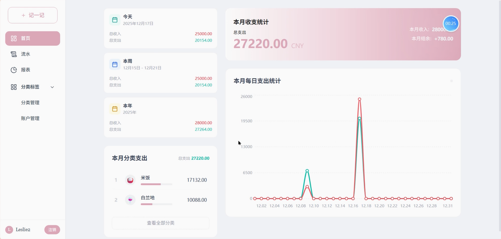
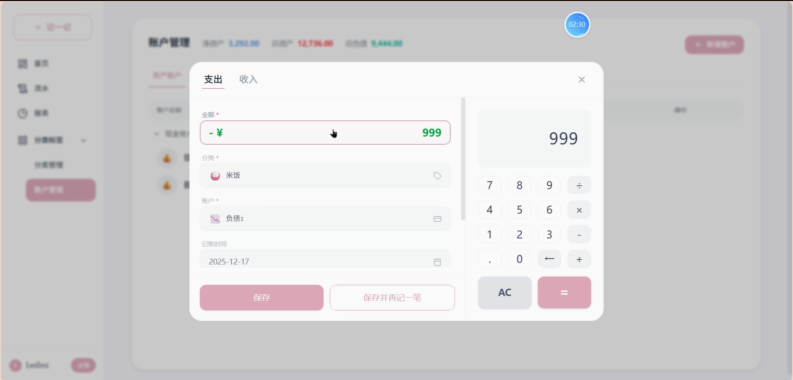
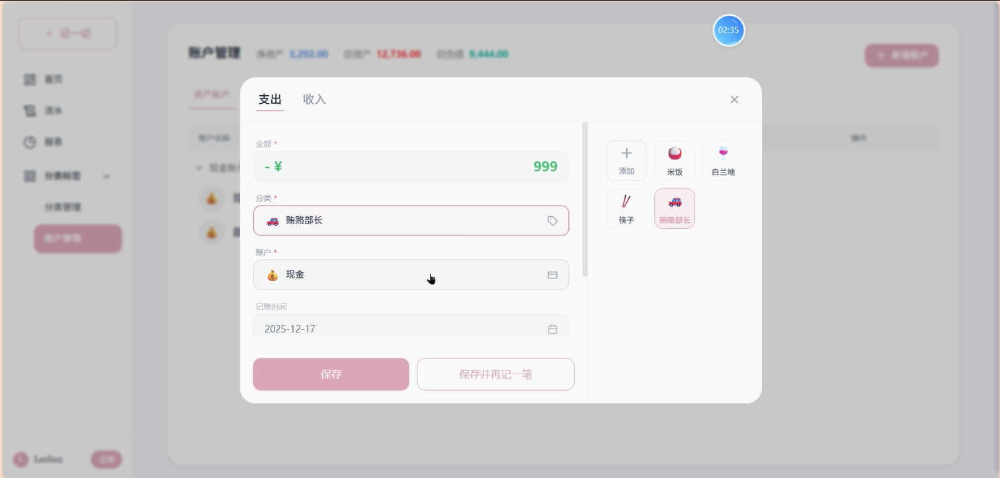
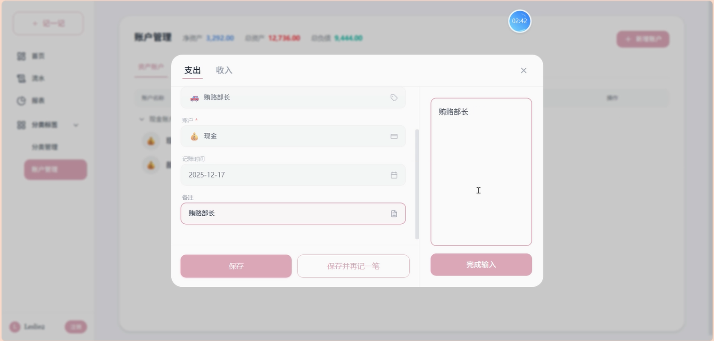
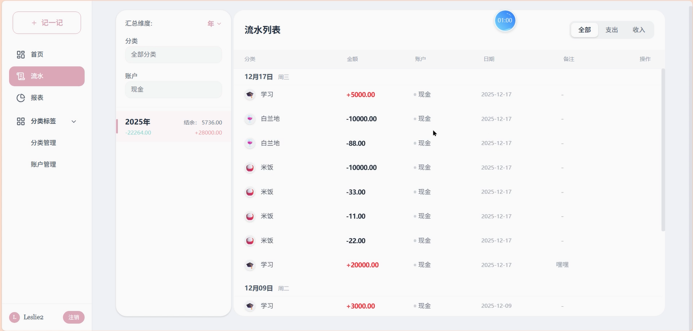
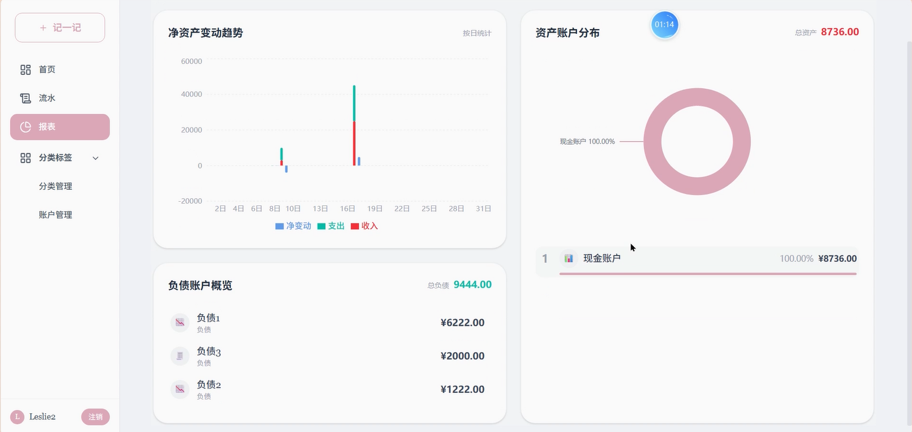
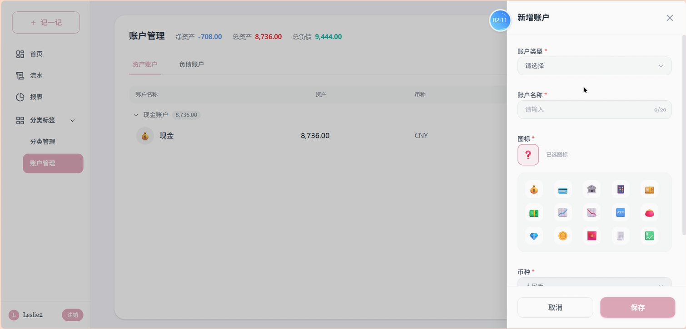
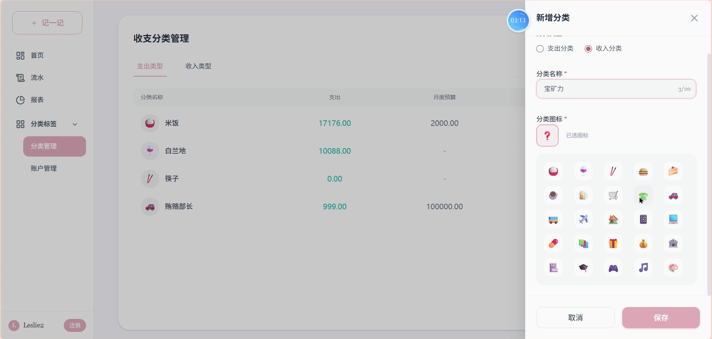

# 个人记账系统 (BuZhang Database) \- 系统实现与界面展示

## 1\. 系统实现概述
本系统采用现代化的前后端分离架构进行开发。前端主要负责页面渲染与用户交互，后端负责业务逻辑处理与数据持久化。

### 1.1 前端实现技术

前端基于 **React 18** 框架构建，使用 **Vite** 作为构建工具，确保了极快的开发启动速度和打包效率。

* **组件化开发**：系统被拆分为多个独立的复用组件（如 Sidebar, TransactionList, RecordTransactionModal），提高了代码的可维护性。  
* **状态管理**：利用 React Hooks (useState, useEffect, useContext) 管理组件内部状态及全局用户状态。  
* **路由管理**：使用 react-router-dom 实现单页应用 (SPA) 的无刷新页面跳转。  
* **网络请求**：封装 Axios 拦截器，统一处理请求头及响应错误。

### 1.2 后端实现技术

后端基于 **Spring Boot** 框架，遵循 MVC 设计模式。

* **控制层 (Controller)**：使用 @RestController 注解暴露 RESTful API，处理前端发来的 JSON 数据。  
* **业务层 (Service)**：封装核心业务逻辑，如“记账时扣减账户余额”的事务一致性处理 (@Transactional)。  
* **持久层 (Mapper)**：使用 **MyBatis** 框架，通过 XML 映射文件与数据库交互。  
* **安全机制**：自定义拦截器 (Interceptor) 验证 HTTP 请求头中的 Token，保障接口安全。

## 2\. 主要运行界面展示

系统界面设计遵循“简洁、直观”的原则，采用侧边栏导航布局，确保用户能快速触达核心功能。

### 2.1 用户注册与登录模块

系统首页为登录页面。为了保护用户隐私，未登录用户无法访问系统内部功能。

* **登录界面 (LoginPage)**：包含用户名/邮箱输入框、密码输入框及“登录”按钮。界面设计简洁，背景通常采用纯色或渐变色。  
* **注册界面 (RegisterPage)**：新用户需提供用户名、邮箱及密码进行注册。前端会对两次输入的密码进行一致性校验。

- 
- 

### 2.2 系统仪表盘/首页 (DashboardHome)

登录成功后进入首页，这里是用户的“财务驾驶舱”，旨在让用户一眼掌握当前的财务状况。

* **核心指标卡片**：  
  * **本月收支统计**：醒目展示当月累计支出与收入金额。
  * **本月分类支出**：展示各分类的支出占比，帮助用户了解钱都花在哪儿了。 
  * **本月每日支出统计**：以折线图形式展示每日支出趋势，帮助用户识别消费高峰期。
* **快捷操作**：左侧侧边栏提供一个显著的“记一笔”按钮，点击即可唤起记账弹窗。  
- 
### 2.3 记账功能 (RecordTransactionModal)

这是系统最高频使用的功能，采用模态框 (Modal) 形式浮于页面之上，避免页面跳转打断用户思路。

* **收支切换**：顶部切换“支出”或“收入”模式。  
* **金额输入**：支出与收入不同颜色的金额输入框，支持计算器计算。
* **分类选择**：以网格形式展示图标（如餐饮、交通、购物），用户点击图标即可选中分类。  
* **账户选择**：以网格形式展示账户图标（如：微信钱包、招商银行卡）。
* **日期与备注**：默认选中当天，支持补录历史账单（用户可以通过右侧日历选择日期）；备注栏用于填写具体消费内容。
* 
* 
* 

### 2.4 交易明细管理 (TransactionList)

用于查看和管理所有的历史账单。

* **时间筛选**：支持按“年-月”筛选数据，例如只查看“2023年10月”的账单。  
* **列表展示**：  
  * **按日分组**：同一天的交易聚合展示，表头显示日期及当日收支小计。  
  * **收支区分**：支出金额通常显示为黑色或红色，收入金额显示为绿色，便于区分。  
* **操作功能**：每条记录右侧提供“编辑”和“删除”按钮。  
  * *注：删除记录时，系统会提示用户该操作将回滚对应的账户余额。*

* 

### 2.5 统计报表分析 (ReportPage)

通过可视化图表帮助用户分析消费习惯。

* **收支构成图 (饼图)**：展示本月各分类支出的占比（例如：餐饮占 40%，房租占 30%）。用户可以直观看到钱都花哪儿了。  
* **账户余额趋势图 (折线/柱状图)**： 展示近一个月各资产账户余额变化趋势，帮助用户了解财富增长情况。
* **资产账户分布图 (环形图)**：展示各资产账户的余额占比，帮助用户了解资金分布情况。

* 

### 2.6 基础设置管理

用户可以根据实际情况定制系统的基础数据。

* **资产账户管理 (AccountManagement)**：  
  * 展示所有账户卡片（包含账户名、类型图标、当前余额）。  
  * 支持新增账户（如新办了一张信用卡）或修改现有账户名称。  
  * 
* **分类管理 (CategoryManagement)**：  
  * 用户可以添加自定义的消费分类，并为其选择合适的图标。  
  * 支持删除不再使用的分类（若该分类下已有账单，通常提示先处理账单）。
  * 

