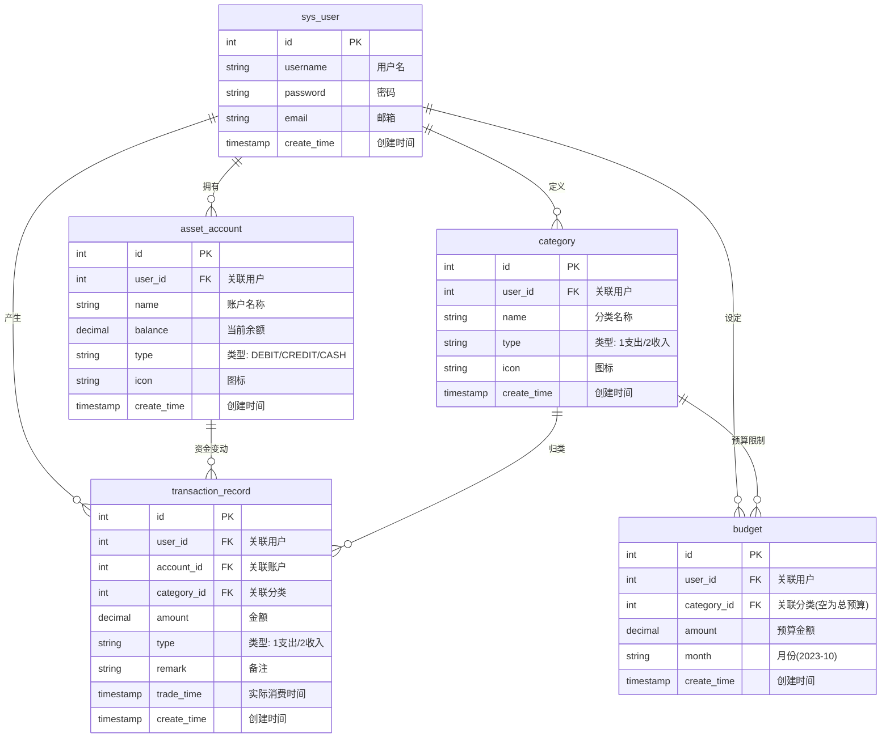

# 个人记账系统 (BuZhang Database) \- 系统设计说明书

## 1\. 系统总体架构设计

本系统采用标准的 **B/S 架构**，实现了前后端分离的开发模式。这种架构降低了系统的耦合度，提高了系统的可维护性和扩展性。

### 1.1 技术架构分层

* **前端表现层 (Frontend)**:  
  * 基于 **React.js** 框架构建单页应用 (SPA)。  
  * 使用 **Vite** 作为构建工具。  
  * 通过 **Axios** 异步发送 HTTP 请求与后端交互。  
  * 负责页面展示、用户交互逻辑及数据可视化渲染。  
* **后端业务层 (Backend)**:  
  * 基于 **Spring Boot** 框架，提供 RESTful API 接口。  
  * **Controller 层**: 处理 HTTP 请求，进行参数校验。  
  * **Service 层**: 封装核心业务逻辑（如记账同时更新余额、预算校验等）。  
  * **Mapper/DAO 层**: 使用 **MyBatis** 框架，通过 **XML 或注解方式执行 SQL 语句**，实现对象与关系数据库的映射 (ORM)。  
* **数据持久层 (Database)**:  
  * 使用数据库 **openGauss** 存储业务数据。

## 2\. 数据库设计

数据库设计是本系统的核心，采用了关系模型来组织数据。所有核心业务表均包含 user\_id 字段，以实现逻辑上的多用户数据隔离。

### 2.1 概念模型设计

系统包含以下 5 个核心实体及其关系：

1. **用户 (SysUser)**: 系统的核心主体。  
   * *关系*: 一个用户可以拥有多个资产账户、多个自定义分类、多条交易记录和多个预算设置。  
2. **资产账户 (AssetAccount)**: 用户的资金存放地（如钱包、银行卡）。  
   * *关系*: 归属于一个用户；作为交易记录的资金来源或去向。  
3. **分类 (Category)**: 交易的属性标签（如餐饮、工资）。  
   * *关系*: 归属于一个用户（或系统默认）；被交易记录引用；被预算引用。  
4. **交易记录 (TransactionRecord)**: 记录资金流动的流水。  
   * *关系*: 关联一个用户、一个账户和一个分类。  
5. **预算 (Budget)**: 用户的消费限额目标。  
   * *关系*: 关联一个用户；可关联特定分类（或针对全局）。

### 2.2 逻辑结构设计

以下是数据库中各表的详细结构设计。

## 3\. 关键业务逻辑设计

### 3.1 记账与余额联动机制

为了保证账目的一致性，系统在处理记账请求时，采用原子性操作（Atomic Operation）同步更新资产余额。

1. **记一笔支出 (Expense)**:  
   * 在 transaction\_record 表插入一条记录。  
   * 查找对应的 asset\_account 记录。  
   * 执行 balance \= balance \- transaction\_amount 更新账户余额。  
2. **记一笔收入 (Income)**:  
   * 在 transaction\_record 表插入一条记录。  
   * 查找对应的 asset\_account 记录。  
   * 执行 balance \= balance \+ transaction\_amount 更新账户余额。  
3. **删除/修改交易**:  
   * 必须进行**回滚操作**：删除支出记录时，需将原金额加回账户余额；删除收入记录时，需将原金额从账户扣除。

### 3.2 数据权限隔离

虽然所有用户的数据存储在同一套物理表中，但系统在应用层实现了严格的数据隔离：

* 所有涉及到数据查询（SELECT）、修改（UPDATE）、删除（DELETE）的 SQL 语句，强制包含 **WHERE user\_id \= ?** 条件。  
* 后端 Controller 层从 Token 中解析当前登录用户的 ID，并将其传递给 Service 层，防止恶意用户通过修改参数 ID 访问他人数据。

## 4\. 接口设计概览

采用 RESTful 风格设计接口，主要资源路径如下：

* /api/users: 用户注册、登录、信息管理。  
* /api/accounts: 资产账户的增删改查。  
* /api/categories: 类别管理。  
* /api/transactions: 交易流水的记录与查询。  
* /api/budgets: 预算设定与监控。  
* /api/reports: 统计报表数据获取。
